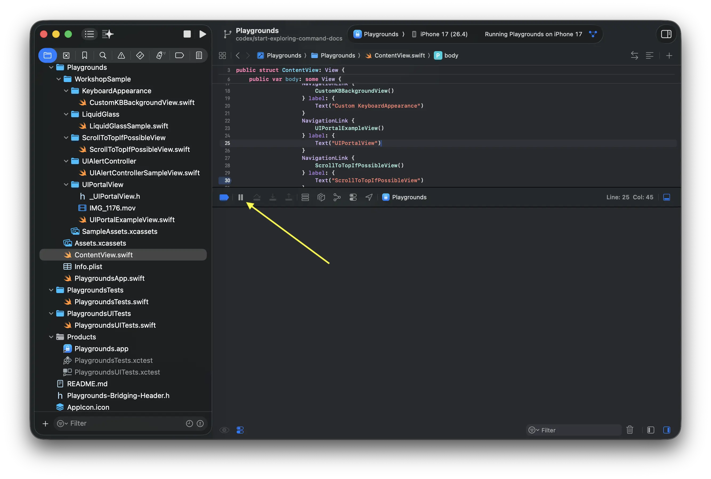
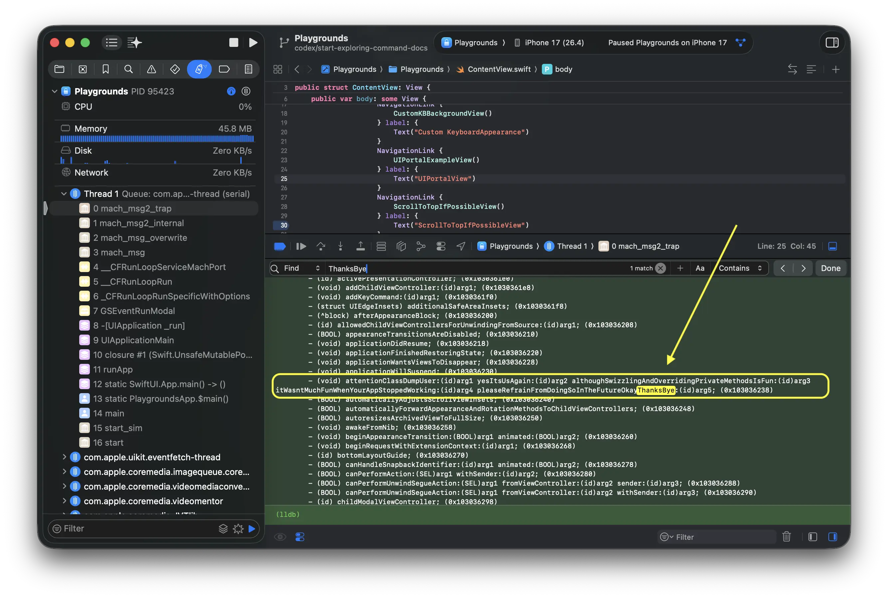

# Start Exploring

When you start looking for private APIs, it is easier to grasp the big picture by first finding the name, checking the declarations, and then comparing them with runtime information.

## Explore with headers.82flex.com

- [headers.82flex.com](https://headers.82flex.com) lists the header files for iOS frameworks.
- It is ideal when you want to search by name first or investigate what is defined in which type.

## Explore with po

- po allows you to check raw data from runtime objects.
- It is suitable when you already know the target view or object and want to see what is visible at runtime.

### Commands

#### `_ivarDescription`

Use `_ivarDescription` to check the list of instance variables.

```lldb
po [(id)0x105a3a2b0 _ivarDescription]
```

The following screenshots show the basic flow in Xcode's debugger.


#### `_shortMethodDescription`

Use `_shortMethodDescription` to quickly inspect the available methods.

```lldb
po [[NSClassFromString(@"UIViewController") new] _shortMethodDescription]
```

The following screenshots show the basic flow in Xcode's debugger.






#### `_methodDescription`

Use `_methodDescription` to inspect the methods in more detail.

```lldb
po [[NSClassFromString(@"UIViewController") new] _methodDescription]
```
