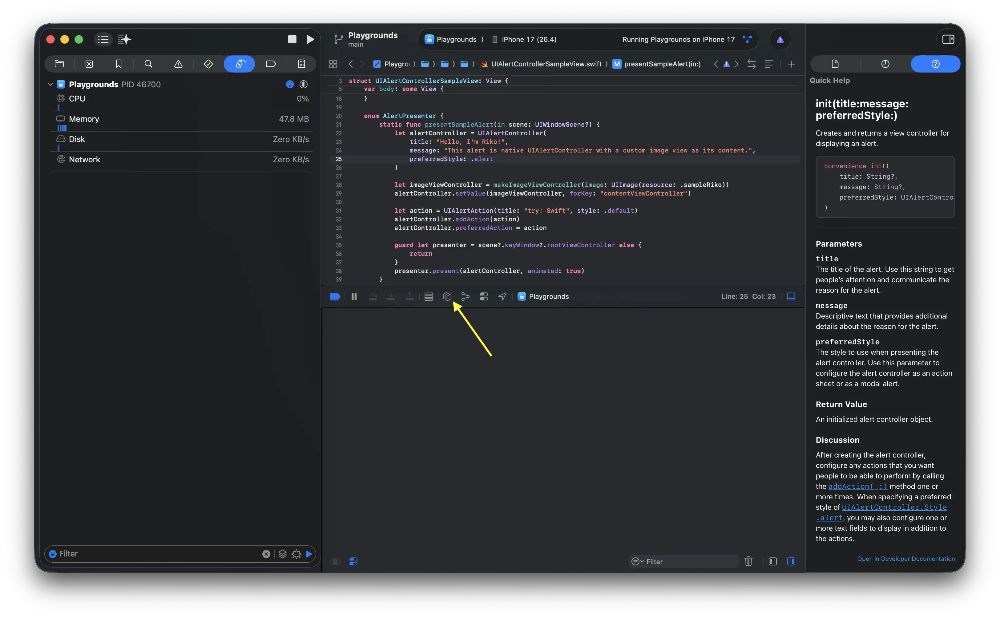
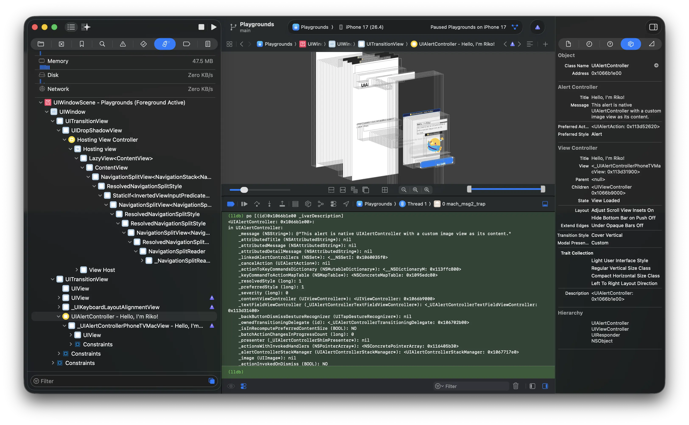

# `_ivarDescription`

Use `_ivarDescription` to check the list of instance variables.

```lldb
po [(id)0x105a3a2b0 _ivarDescription]
```

The following screenshots show the basic flow in Xcode's debugger.





